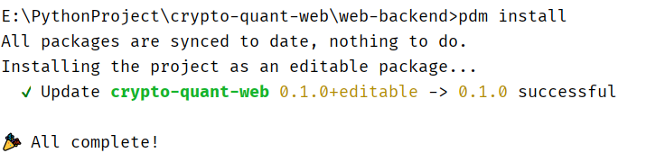
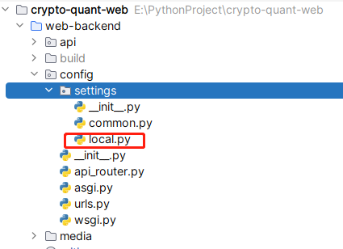
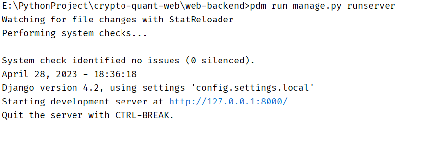

# 系统环境
- 操作系统：window10
- Idea：Pycharm
- python10，使用pdm管理项目环境

#### 环境配置
确定当前路径是在web-backend目录下!!!

.pdm-python填写的是你本地python编译器所在路径

运行命令:
```shell
pdm install
```


# 数据库配置
进入config目录下settings目录，打开local.py, 设置database配置项,提前创建好CryptoTraderWeb数据库。
```shell
create database cryptotraderweb charset utf8;
```


```shell
DATABASES = {
    "default": {
        "ENGINE": "django.db.backends.mysql",
        "NAME": "CryptoTraderWeb",
        "USER": "root",
        "PASSWORD": "123456",
        "HOST": "127.0.0.1",
        "PORT": 3306,
    }
}

CACHES = {
    'default': {
        'BACKEND': 'django_redis.cache.RedisCache',
        'LOCATION': 'redis://127.0.0.1:6379/1',
        'OPTIONS': {
            'CLIENT_CLASS': 'django_redis.client.DefaultClient',
        }
    }
}

```
# 项目启动
```shell
# 数据库迁移

pdm run manage.py makemigrations
pdm run manage.py migrate

# 运行项目
pdm run manage.py runserver
```

# celery启动命令
```shell
celery -A api.apps.utils.celery worker  -l info
```

大功告成！!


